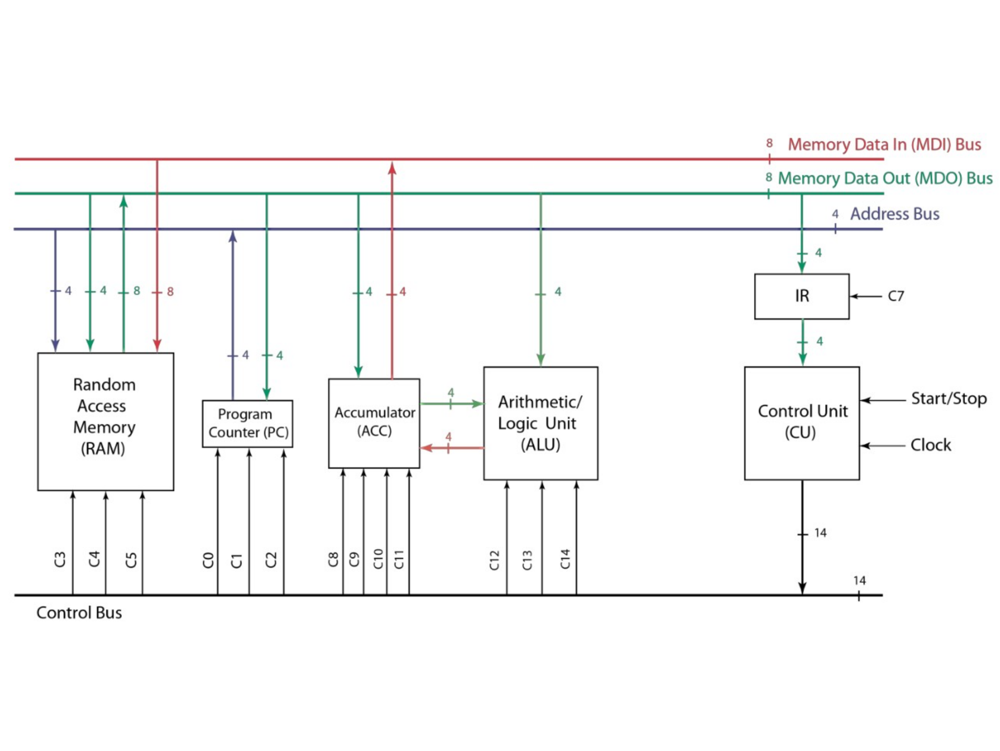
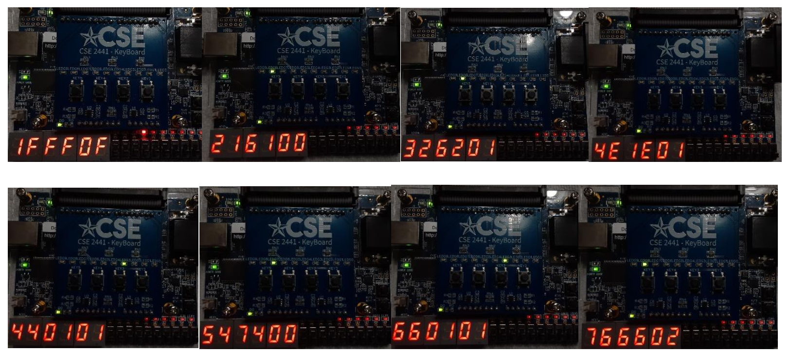

# 🚀 TRISC Processor - FPGA Implementation  

## 📌 Project Overview  
The **TRISC Processor** is a simple **4-bit processor** implemented on a **Terasic DE10-Lite FPGA** using **Quartus Prime** and **Verilog HDL**. This project integrates multiple digital components, including:  

- **Arithmetic Logic Unit (ALU)**  
- **Control Unit (CU)**  
- **Accumulator (ACC)**  
- **Program Counter (PC)**  
- **Instruction Register (IR)**  
- **Random-Access Memory (RAM)**  

By combining these modules, the processor executes fundamental operations such as **LDA (Load), STA (Store), ADD (Addition), INC (Increment), CLR (Clear), and JMP (Jump).**  

  

  

---

## 🎯 Project Requirements  
This project required:  
✔️ **A fully designed, simulated, implemented, and tested processor**  
✔️ **Integration of individual modules into a complete TRISC system**  
✔️ **A project report covering all aspects of the design**  

### 🔍 **Key Objectives:**  
- Simulate the TRISC design before implementation  
- Load a given program into RAM before execution  
- Validate functionality using **test benches and real FPGA testing**  

---

## ⚙️ System Design  
The processor operates as a **4-bit single-cycle architecture**, executing instructions stored in RAM. Below are the major components:  

### 🔹 **Arithmetic Logic Unit (ALU)**  
Performs fundamental operations like addition and bitwise logic.  

### 🔹 **Control Unit (CU)**  
Decodes instructions and controls data flow.  

### 🔹 **Accumulator (ACC)**  
Holds intermediate computational results.  

### 🔹 **Program Counter (PC)**  
Tracks the address of the next instruction.  

### 🔹 **Random-Access Memory (RAM)**  
Stores instructions and temporary data.  

  

  

<b>Figure 1: Block Diagram of the TRISC Processor</b>
  

---

## 🏗️ Controller Design  
The **Control Unit (CU)** generates necessary signals to drive the execution of TRISC instructions. It consists of:  
- **Instruction Decoder**  
- **Timing and Control Logic**  
- **ALU and Memory Control Signals**  

The CU ensures proper execution flow based on a **finite-state machine (FSM)**, determining what each component should do at any given clock cycle.  

---

## 📊 Test Results  
The TRISC processor was tested with multiple **assembly-style programs** to verify its performance. **Waveform simulations in Quartus Prime** confirmed correct execution, and real-world testing on the **DE10-Lite FPGA** validated the results.  

### Summary  
After loading the program into the TRISC RAM loader, various instructions were executed, and different outputs were displayed on the DE10-Lite board.  

- The first output value was **F**, corresponding to the program instruction `0F`.  
  - **Opcode:** `0000`  
  - **Instruction:** `LDA (Load)` – Value **F** was loaded into the accumulator.  

- The next loaded program was `61`, corresponding to the **Increment (INC)** instruction:  
  - **Opcode:** `0110`  
  - **Instruction:** `INC` – The value incremented to **0**.  

- The next program, `62`, also implemented the **Increment (INC)** instruction:  
  - The value incremented to **1**.  

- This process continued for the rest of the program loaded into RAM at the beginning of the test.  

✅ **All output values matched the expected results for each instruction, confirming correct processor execution.**  

  

  

<b>Figure 2: Simulation Results of TRISC Processor</b>
  

---

## 🔧 How to Use  

### 🛠️ Requirements  
- **Intel Quartus Prime (Lite or Standard)**
- **Terasic DE10-Lite FPGA Board**
- **USB-Blaster for FPGA Programming**
- **ModelSim (for simulation, optional)**

## 📂 Project Report

For a detailed breakdown of the project, including design methodologies, implementation details, and test results, refer to the full project report:

📄 **[TRISC Processor Project Report](docs/TRISC_Processor_Project_Report.pdf)**  

---

## 🔮 Future Improvements

✅ Expand instruction set for more complex operations  
✅ Implement pipelining for improved performance  
✅ Design a memory-mapped I/O system  
✅ Optimize power consumption for embedded applications 
